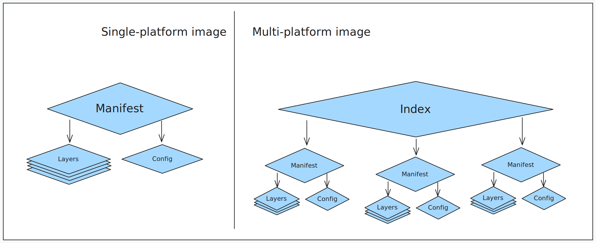

## Distroless

<!-- <p align="center">
  
</p> -->

As imagens "Distroless" contêm apenas seu aplicativo e suas dependências de tempo de execução. Elas não contêm gerenciadores de pacotes, shells ou quaisquer outros programas que você esperaria encontrar em uma distribuição Linux padrão.

Restringir o que está em seu contêiner de tempo de execução precisamente ao que é necessário para seu aplicativo é uma prática recomendada, principalemente em ambientes produtivos. É ai que o distroless vem para ajudar a resolver este problema, criando imagens somente com o que é necessário.

> Imagem distroless, não inclui o shell e qualquer outra ferramenta para ajudar no troubleshooting, para contornar este problema é necessário utilizar um [Container Efêmero](https://kubernetes.io/docs/tasks/debug/debug-application/debug-running-pod/#ephemeral-container), que serve para executar um container com uma imagem que serviria de "canivete suíço", para atachar no container da aplicação para fazer troubleshooting. Esta abordagem veremos exemplo mais a frente.

### Diferenças entre *Imagem Comum* x *Distroless*

#### IMAGEM COMUM

Para fins de comparação, será utilizada uma imagem Java 21 distribuída pela AWS, tendo como base o Alpine: amazoncorretto:21.0.8-alpine3.22.

#### SBOM

Para essa análise, será listado o conteúdo completo da imagem por meio do SBOM (Software Bill of Materials) — uma Lista de Materiais de Software. Ele funciona como um “rótulo nutricional” do container, descrevendo todas as bibliotecas, pacotes, dependências, versões e origens que compõem a imagem.

1. Abaixo iremos listar as dependencias da imagens *SBOM* da imagem amazoncorreto java 21 utilizando Alpine 3.22.

```terminal
docker sbom amazoncorretto:21.0.8-alpine3.22
```
Output:
```terminal
Syft v0.43.0
 ✔ Pulled image
 ✔ Loaded image
 ✔ Parsed image
 ✔ Cataloged packages      [19 packages]

NAME                    VERSION        TYPE
alpine-baselayout       3.7.0-r0       apk
alpine-baselayout-data  3.7.0-r0       apk
alpine-keys             2.5-r0         apk
alpine-release          3.22.1-r0      apk
amazon-corretto-21      21.0.8.9.1-r0  apk
apk-tools               2.14.9-r2      apk
busybox                 1.37.0-r18     apk
busybox-binsh           1.37.0-r18     apk
ca-certificates-bundle  20250619-r0    apk
java-common             0.5-r0         apk
jrt-fs                  21.0.8         java-archive
libapk2                 2.14.9-r2      apk
libcrypto3              3.5.1-r0       apk
libssl3                 3.5.1-r0       apk
musl                    1.2.5-r10      apk
musl-utils              1.2.5-r10      apk
scanelf                 1.3.8-r1       apk
ssl_client              1.37.0-r18     apk
zlib                    1.3.1-r2       apk
```

Repare na quantidade de bibliotecas que tem esta imagem, apesar de utilizar o alpine e imagem oficial da AWS, isso não significa que esta imagem é uma imagem enxuta.

2. Checando vulnerabilidades da imagem `amazoncorretto:21.0.8-alpine3.22` utilizando a ferramenta [grype](https://github.com/anchore/grype).

```terminal
grype amazoncorretto:21.0.8-alpine3.22
```
Output:
```terminal
 ✔ Loaded image                                                                                                                                                                              amazoncorretto:21.0.8-alpine3.22 
 ✔ Parsed image                                                                                                                                       sha256:47ed9633034573dd42097d58b69bbc20b6ce33b1f9904ad5526001485051e28b 
 ✔ Cataloged contents                                                                                                                                        d7dfe789edbb3d5175b1ddec3de72b4ef9f1133df1a0ba952bd1b2bddba44a83 
   ├── ✔ Packages                        [19 packages]  
   ├── ✔ Executables                     [87 executables]  
   ├── ✔ File metadata                   [536 locations]  
   └── ✔ File digests                    [536 files]  
 ✔ Scanned for vulnerabilities     [12 vulnerability matches]  
   ├── by severity: 0 critical, 2 high, 4 medium, 6 low, 0 negligible
NAME           INSTALLED   FIXED IN  TYPE  VULNERABILITY   SEVERITY  EPSS          RISK   
libcrypto3     3.5.1-r0    3.5.4-r0  apk   CVE-2025-9230   High      < 0.1% (3rd)  < 0.1  
libssl3        3.5.1-r0    3.5.4-r0  apk   CVE-2025-9230   High      < 0.1% (3rd)  < 0.1  
libcrypto3     3.5.1-r0    3.5.4-r0  apk   CVE-2025-9232   Medium    < 0.1% (5th)  < 0.1  
libssl3        3.5.1-r0    3.5.4-r0  apk   CVE-2025-9232   Medium    < 0.1% (5th)  < 0.1  
libcrypto3     3.5.1-r0    3.5.4-r0  apk   CVE-2025-9231   Medium    < 0.1% (1st)  < 0.1  
libssl3        3.5.1-r0    3.5.4-r0  apk   CVE-2025-9231   Medium    < 0.1% (1st)  < 0.1  
busybox        1.37.0-r18            apk   CVE-2025-46394  Low       < 0.1% (1st)  < 0.1  
busybox-binsh  1.37.0-r18            apk   CVE-2025-46394  Low       < 0.1% (1st)  < 0.1  
ssl_client     1.37.0-r18            apk   CVE-2025-46394  Low       < 0.1% (1st)  < 0.1  
busybox        1.37.0-r18            apk   CVE-2024-58251  Low       < 0.1% (2nd)  < 0.1  
busybox-binsh  1.37.0-r18            apk   CVE-2024-58251  Low       < 0.1% (2nd)  < 0.1  
ssl_client     1.37.0-r18            apk   CVE-2024-58251  Low       < 0.1% (2nd)  < 0.1
```
Conforme o output abaixo, a imagem `amazoncorretto:21.0.8-alpine3.22` apresenta diversas bibliotecas com vulnerabilidades [CVEs](https://pt.wikipedia.org/wiki/Common_Vulnerabilities_and_Exposures) abertas, classificadas nos níveis High, Medium e Low.

3. Como podemos ver a imagem tem 521MB.

```terminal
docker image ls
```
Output:
```terminal
REPOSITORY       TAG                 IMAGE ID       CREATED        SIZE
amazoncorretto   21.0.8              0f096ec2cb6f   2 weeks ago    521MB
```


### Criando uma imagem Distroless

Para criar uma imagem distroless, irei utilizar a ferramenta [apko](https://github.com/chainguard-dev/apko).

O [apko](https://github.com/chainguard-dev/apko) é uma ferramenta (CLI) Open Source disrtibuída pela [Chainguard Containers](https://edu.chainguard.dev/chainguard/chainguard-images/overview/), para criar imagens somente com uma layer utilizando o [apk](https://wiki.alpinelinux.org/wiki/Alpine_Package_Keeper) como gerenciador de pacotes. O apko utiliza um manifesto em yaml para buildar a image.

### Build de imagem Distroless com APKO

1. Como pré requisito é necessário instalar o APKO
Siga as instruções [clique aqui!](https://edu.chainguard.dev/chainguard/chainguard-images/overview/)
2. Crie o arquivo `image-base.yaml` e cole o conteúdo abaixo:

```yaml
contents:
  keyring:
    - https://packages.wolfi.dev/os/wolfi-signing.rsa.pub
  repositories:
    - https://packages.wolfi.dev/os
  packages:
    - openjdk-21
    - ca-certificates
    # - bash
    # - coreutils

work-dir: /app

# entrypoint:
#   command: java -jar ./app.jar

environment:
  JAVA_HOME: /usr/lib/jvm/java-21-openjdk
  PATH: /usr/local/sbin:/usr/local/bin:/usr/sbin:/usr/bin:/sbin:/bin:/usr/lib/jvm/java-21-openjdk/bin

archs:
  - arm64
```

3. Com o arquivo criado execute, iremos criar a imagem.
A imagem será exportada para o arquivo java21.tar

```
apko build java-21.yaml gersontpc/java-base21 java21.tar
```
Output:
```
2025/10/12 22:35:49 INFO installing wolfi-baselayout (20230201-r24) arch=aarch64
2025/10/12 22:35:49 INFO installing ca-certificates-bundle (20250619-r6) arch=aarch64
2025/10/12 22:35:49 INFO installing glibc-locale-posix (2.42-r1) arch=aarch64
2025/10/12 22:35:49 INFO installing libgcc (15.2.0-r2) arch=aarch64
2025/10/12 22:35:49 INFO installing glibc (2.42-r1) arch=aarch64
2025/10/12 22:35:49 INFO installing ld-linux (2.42-r1) arch=aarch64
2025/10/12 22:35:49 INFO installing alsa-lib (1.2.14-r2) arch=aarch64
2025/10/12 22:35:49 INFO installing libcrypto3 (3.6.0-r0) arch=aarch64
2025/10/12 22:35:49 INFO installing ca-certificates (20250619-r6) arch=aarch64
2025/10/12 22:35:49 INFO installing fontconfig-config (2.17.1-r1) arch=aarch64
2025/10/12 22:35:49 INFO installing libbrotlicommon1 (1.1.0-r7) arch=aarch64
2025/10/12 22:35:49 INFO installing libbrotlidec1 (1.1.0-r7) arch=aarch64
2025/10/12 22:35:49 INFO installing libbz2-1 (1.0.8-r21) arch=aarch64
2025/10/12 22:35:49 INFO installing zlib (1.3.1-r51) arch=aarch64
2025/10/12 22:35:49 INFO installing libpng (1.6.50-r2) arch=aarch64
2025/10/12 22:35:49 INFO installing freetype (2.14.1-r0) arch=aarch64
2025/10/12 22:35:49 INFO installing giflib (5.2.2-r10) arch=aarch64
2025/10/12 22:35:49 INFO installing libffi (3.5.2-r1) arch=aarch64
2025/10/12 22:35:49 INFO installing libtasn1 (4.20.0-r5) arch=aarch64
2025/10/12 22:35:49 INFO installing p11-kit (0.25.10-r0) arch=aarch64
2025/10/12 22:35:49 INFO installing p11-kit-trust (0.25.10-r0) arch=aarch64
2025/10/12 22:35:49 INFO installing java-cacerts (20250619-r4) arch=aarch64
2025/10/12 22:35:49 INFO installing lcms2 (2.17-r5) arch=aarch64
2025/10/12 22:35:49 INFO installing libexpat1 (2.7.3-r0) arch=aarch64
2025/10/12 22:35:49 INFO installing libfontconfig1 (2.17.1-r1) arch=aarch64
2025/10/12 22:35:49 INFO installing libjpeg-turbo (3.1.2-r0) arch=aarch64
2025/10/12 22:35:49 INFO installing libxau (1.0.12-r3) arch=aarch64
2025/10/12 22:35:49 INFO installing libxdmcp (1.1.5-r9) arch=aarch64
2025/10/12 22:35:49 INFO installing libxcb (1.17.0-r8) arch=aarch64
2025/10/12 22:35:49 INFO installing libx11 (1.8.12-r3) arch=aarch64
2025/10/12 22:35:49 INFO installing libxext (1.3.6-r7) arch=aarch64
2025/10/12 22:35:49 INFO installing libxi (1.8.2-r3) arch=aarch64
2025/10/12 22:35:49 INFO installing libxrender (0.9.12-r4) arch=aarch64
2025/10/12 22:35:49 INFO installing libxtst (1.2.5-r3) arch=aarch64
2025/10/12 22:35:49 INFO installing ttf-dejavu (2.37-r7) arch=aarch64
2025/10/12 22:35:49 INFO installing openjdk-21 (21.0.8-r4) arch=aarch64
2025/10/12 22:35:50 INFO layer digest: sha256:b74553f73880bf2396f3b836355e602d05b77f669fc23afe161c6af166d2e686 arch=aarch64
2025/10/12 22:35:50 INFO layer diffID: sha256:e33e883d2456961cbeb60513f83329c83bebacd3da8de7fae4f32dcd28505f40 arch=aarch64
2025/10/12 22:35:50 INFO duplicate package ID found in SBOM, deduplicating package... arch=aarch64 arch=aarch64 ID=SPDXRef-Package-glibc.yaml-772262bfa6ed63074d05f3ede69e2be9253c12c4
2025/10/12 22:35:50 INFO duplicate package ID found in SBOM, deduplicating package... arch=aarch64 arch=aarch64 ID=SPDXRef-Package-repo.or.cz-glibc.git-glibc-2.42-d2097651cc57834dbfcaa102ddfacae0d86cfb66-0
2025/10/12 22:35:50 INFO duplicate package ID found in SBOM, deduplicating package... arch=aarch64 arch=aarch64 ID=SPDXRef-Package-glibc.yaml-772262bfa6ed63074d05f3ede69e2be9253c12c4
2025/10/12 22:35:50 INFO duplicate package ID found in SBOM, deduplicating package... arch=aarch64 arch=aarch64 ID=SPDXRef-Package-repo.or.cz-glibc.git-glibc-2.42-d2097651cc57834dbfcaa102ddfacae0d86cfb66-0
2025/10/12 22:35:50 INFO duplicate package ID found in SBOM, deduplicating package... arch=aarch64 arch=aarch64 ID=SPDXRef-Package-ca-certificates.yaml-ba7ece3f2437a8e7fb3a33424a942dbc3f402f0d
2025/10/12 22:35:50 INFO duplicate package ID found in SBOM, deduplicating package... arch=aarch64 arch=aarch64 ID=SPDXRef-Package-gitlab.alpinelinux.org-alpine-ca-certificates-20250619-1ed28eb21ca591b93cd5bfdc4a9c71ca63593dc0-0
2025/10/12 22:35:50 INFO duplicate package ID found in SBOM, deduplicating package... arch=aarch64 arch=aarch64 ID=SPDXRef-Package-brotli.yaml-c04a9958adfd437f018ddfdb2dcd43f17a4d4404
2025/10/12 22:35:50 INFO duplicate package ID found in SBOM, deduplicating package... arch=aarch64 arch=aarch64 ID=SPDXRef-Package-github.com-google-brotli.git-v1.1.0-ed738e842d2fbdf2d6459e39267a633c4a9b2f5d-0
2025/10/12 22:35:50 INFO duplicate package ID found in SBOM, deduplicating package... arch=aarch64 arch=aarch64 ID=SPDXRef-Package-p11-kit.yaml-118ce34ba5add367103917f7375ac29ae2e3be36
2025/10/12 22:35:50 INFO duplicate package ID found in SBOM, deduplicating package... arch=aarch64 arch=aarch64 ID=SPDXRef-Package-p11-kit-0.25.10-0
2025/10/12 22:35:50 INFO duplicate package ID found in SBOM, deduplicating package... arch=aarch64 arch=aarch64 ID=SPDXRef-Package-fontconfig.yaml-ed999153fde4e394f42111a739270323985c118e
2025/10/12 22:35:50 INFO duplicate package ID found in SBOM, deduplicating package... arch=aarch64 arch=aarch64 ID=SPDXRef-Package-gitlab.freedesktop.org-fontconfig-fontconfig.git-2.17.1-6d0a98982ec351c165c9224c8b7dbdfca3010e47-0
2025/10/12 22:35:50 INFO built index file as /var/folders/fd/6ptrjczs03g_6_459mz1wjkc0000gn/T/apko-temp-1698691948/index.json
...
```

3. Importe a imagem utilizando o Docker.

```terminal
docker load < java21.tar
```
Output:
```
e33e883d2456: Loading layer [==================================================>]  102.4MB/102.4MB
Loaded image: gersontpc/java-base21:latest-arm64
```

4. Liste a imagem. Como podemos ver a imagem tem 285MB, quase a metade da imagem do amazon correto.

```terminal
docker image ls
```
Output:
```output
REPOSITORY              TAG               IMAGE ID       CREATED       SIZE
gersontpc/java-base21   latest-arm64      719bb2801e42   2 days ago    283MB
```

5. Agora iremos checar as dependências da imagem utilizando o `docker sbom`.

```terminal
docker sbom java-base21:latest-arm64
```
Output:
```terminal
Syft v0.43.0
 ✔ Loaded image
 ✔ Parsed image
 ✔ Cataloged packages      [37 packages]

NAME                    VERSION       TYPE
alsa-lib                1.2.14-r2     apk
ca-certificates         20250619-r6   apk
ca-certificates-bundle  20250619-r6   apk
fontconfig-config       2.17.1-r1     apk
freetype                2.14.1-r0     apk
giflib                  5.2.2-r10     apk           
glibc                   2.42-r0       apk           
glibc-locale-posix      2.42-r0       apk           
java-cacerts            20250619-r4   apk           
jrt-fs                  21.0.8        java-archive  
lcms2                   2.17-r5       apk           
ld-linux                2.42-r0       apk           
libbrotlicommon1        1.1.0-r7      apk           
libbrotlidec1           1.1.0-r7      apk           
libbz2-1                1.0.8-r21     apk           
libcrypto3              3.5.4-r0      apk           
libexpat1               2.7.3-r0      apk           
libffi                  3.5.2-r1      apk           
libfontconfig1          2.17.1-r1     apk           
libgcc                  15.2.0-r2     apk           
libjpeg-turbo           3.1.2-r0      apk           
libpng                  1.6.50-r1     apk           
libtasn1                4.20.0-r5     apk           
libx11                  1.8.12-r3     apk           
libxau                  1.0.12-r3     apk           
libxcb                  1.17.0-r8     apk           
libxdmcp                1.1.5-r9      apk           
libxext                 1.3.6-r7      apk           
libxi                   1.8.2-r3      apk           
libxrender              0.9.12-r4     apk           
libxtst                 1.2.5-r3      apk           
openjdk-21              21.0.8-r4     apk           
p11-kit                 0.25.10-r0    apk           
p11-kit-trust           0.25.10-r0    apk           
ttf-dejavu              2.37-r7       apk           
wolfi-baselayout        20230201-r24  apk           
zlib                    1.3.1-r51     apk
```

6. Execute o `grype` para checar as vulnerabilidades da imagem

```terminal
grype java-base21:latest-arm64
```
Output:
```terminal
 ✔ Loaded image                                                                                                                                                                                      java-base21:latest-arm64
 ✔ Parsed image                                                                                                                                       sha256:320e925c69d102b5bdc578b926eefe5074d3bf7cd8cc6704d39b7d19188b8d9f 
 ✔ Cataloged contents                                                                                                                                        878669b7c78a859d1e9268101d9157a86805f836c1bea2b686849231c668700e 
   ├── ✔ Packages                        [37 packages]  
   ├── ✔ Executables                     [147 executables]  
   ├── ✔ File metadata                   [982 locations]  
   └── ✔ File digests                    [982 files]  
 ✔ Scanned for vulnerabilities     [0 vulnerability matches]  
   ├── by severity: 0 critical, 0 high, 0 medium, 0 low, 0 negligible
No vulnerabilities found
```

### Conclusão entre as imagens

Como podemos ver, a imagem distroless criada com o apko apresenta um tamanho significativamente menor, com 285MB, em comparação com os 521MB da imagem comum baseada em Amazon Correto Alpine. Além disso, a análise de vulnerabilidades com grype indicou que a imagem distroless não possui vulnerabilidades conhecidas, enquanto a imagem comum apresenta diversas CVEs em diferentes níveis de severidade. Isso reforça que imagens distroless, ao conter apenas o essencial para execução, oferecem maior segurança e controle, tornando-se uma escolha preferencial para ambientes produtivos que priorizam a redução da superfície de ataque e maior confiabilidade.

## Multi Plataforma


Antes de criar uma imagem multi plataforma, iremos realizar o build de uma imagem `amazoncorretto:21.0.8-alpine3.22` utilizando o `docker build`.

```terminal
FROM amazoncorretto:21.0.8-alpine3.22
```

1. Realize o build da imagem e em seguida o push para o docker hub.

```terminal
docker image build -t gersontpc/amazoncorretto-single-arch:21.0.8-alpine3.22 . && docker image push gersontpc/amazoncorretto-single-arch:21.0.8-alpine3.22
```

Output:
```terminal
[+] Building 0.0s (5/5) FINISHED                                                    docker:desktop-linux
 => [internal] load build definition from Dockerfile                                                0.0s
 => => transferring dockerfile: 74B                                                                 0.0s
 => [internal] load metadata for docker.io/library/amazoncorretto:21.0.8-alpine3.22                 0.0s
 => [internal] load .dockerignore                                                                   0.0s
 => => transferring context: 2B                                                                     0.0s
 => CACHED [1/1] FROM docker.io/library/amazoncorretto:21.0.8-alpine3.22                            0.0s
 => exporting to image                                                                              0.0s
 => => exporting layers                                                                             0.0s
 => => writing image sha256:402a0937579d1797afdef2806969749952a59d0dc62c879614a20ea785f5210e        0.0s
 => => naming to docker.io/library/gersontpc/amazoncorretto-single-arch:21.0.8-alpine3.22


View build details: docker-desktop://dashboard/build/desktop-linux/desktop-linux/mb7scwu95w587hneq2gbqk24d
The push refers to repository [docker.io/gersontpc/amazoncorretto-single-arch]
4806db88e1e1: Layer already exists
0e64f2360a44: Layer already exists
21.0.8-alpine3.22: digest: sha256:f2d5e702ee63a57d3047915aff836de26f1fa77e634433492c22d1661c1fd9dd size: 741
```

3. Para verfificar a arquitetura da imagem utilize o comando `docker manifest`.

```terminal
docker manifest inspect --verbose gersontpc/amazoncorretto-single-arch:21.0.8-alpine3.22 | jq .Descriptor.platform
```
Output:
```terminal
{
  "architecture": "arm64",
  "os": "linux"
}
```
Como a imagem que eu fiz o build foi do meu notebook a arquitetura `arm64`, utilizando o `docker build` ele irá utilizar a arquitetura do meu notebook.

4. Vamos verificar a arquitetura da imgem anets de fazer o build

```terminal
docker manifest inspect --verbose amazoncorretto:21.0.8-alpine3.22 | jq '.[].Descriptor.platform'
```
Output:
```terminal
{
  "architecture": "amd64",
  "os": "linux"
}
{
  "architecture": "unknown",
  "os": "unknown"
}
{
  "architecture": "arm64",
  "os": "linux",
  "variant": "v8"
}
{
  "architecture": "unknown",
  "os": "unknown"
}
```

## Multi Plataforma

Entendendo Builds Multi-plataforma

O build multi-plataforma refere-se a uma única execução de build que gera imagens para múltiplas combinações de sistemas operacionais e arquiteturas de CPU. Isso permite criar uma única imagem Docker que pode ser executada em vários ambientes, como linux/amd64, linux/arm64 e windows/amd64.

Diferença entre imagens single-platform e multi-platform

<!--  -->

Imagens single-platform possuem uma estrutura simples: um único manifesto que aponta para uma configuração e um conjunto de camadas. Já imagens multi-platform possuem uma lista de manifestos, cada um apontando para uma configuração e camadas distintas para uma arquitetura específica.

Quando você envia (push) uma imagem multi-plataforma para um registro, o registro armazena a lista de manifestos e todos os manifestos individuais. Ao puxar (pull) a imagem, o Docker seleciona automaticamente a variante correta com base na arquitetura do host, garantindo portabilidade transparente entre diferentes hardwares.


Para criar a imagem multi arquitetura iremos utilizar o `buildx`, e para isso a imagem precisa estar em algum artifactory, neste caso irei utilizar o DockerHub.
> Não funciona se utilizar registry local em container

1. Push da imagem local para o dockerhub.

```terminal
docker image push gersontpc/java-base21:latest-arm64 
```
Outuput:
```terminal
The push refers to repository [docker.io/gersontpc/java-base21]
e33e883d2456: Pushed 
latest-arm64: digest: sha256:80029d2f2c4be85527e1cb862a7087ee93e014987d211c879a22a46b893304c5 size: 528
```

2. Crie um Dockerfile referenciando a imagem criada pelo APKO.

```terminal
FROM gersontpc/java-base21:latest-arm64
```

3. Agora realize o build da imagem utilizando o `buildx` utilizando o dockerfile

```terminal
docker buildx build --platform linux/arm64,linux/amd64 -t gersontpc/java21:latest --push .
```
Output:

```terminal
[+] Building 8.3s (9/9) FINISHED                                                                                                                                                                                                 docker-container:mybuilder
 => [internal] load build definition from Dockerfile                                                                                                  0.0s
 => => transferring dockerfile: 76B                                                                                                                   0.0s
 => [linux/arm64 internal] load metadata for docker.io/gersontpc/java-base21:latest-arm64                                                             0.3s
 => [linux/amd64 internal] load metadata for docker.io/gersontpc/java-base21:latest-arm64                                                             0.5s
 => [internal] load .dockerignore                                                                                                                     0.0s
 => => transferring context: 2B                                                                                                                       0.0s
 => [linux/arm64 1/1] FROM docker.io/gersontpc/java-base21:latest-arm64@sha256:80029d2f2c4be85527e1cb862a7087ee93e014987d211c879a22a46b893304c5       0.0s
 => => resolve docker.io/gersontpc/java-base21:latest-arm64@sha256:80029d2f2c4be85527e1cb862a7087ee93e014987d211c879a22a46b893304c5                   0.0s
 => [linux/amd64 1/1] FROM docker.io/gersontpc/java-base21:latest-arm64@sha256:80029d2f2c4be85527e1cb862a7087ee93e014987d211c879a22a46b893304c5       0.0s
 => => resolve docker.io/gersontpc/java-base21:latest-arm64@sha256:80029d2f2c4be85527e1cb862a7087ee93e014987d211c879a22a46b893304c5                   0.0s
 => exporting to image                                                                                                                                7.7s
 => => exporting layers                                                                                                                               0.0s
 => => exporting manifest sha256:526de2b1a02e40dd87f9953505d028f371dfa30489f5f9190776868b6fbd0106                                                     0.0s
 => => exporting config sha256:505eb7c454b4416ff7da66f6338952187c294d388f16475b05b829277d43247a                                                       0.0s
 => => exporting attestation manifest sha256:4d187638ffba65d2b063f837c5f7f75b0eb196950ac6e643246e827c1764b182                                         0.0s
 => => exporting manifest sha256:8c16884efa95934efc6fd2fa1523f4ffd18f237f510ba5016369d3cd9f95864a                                                     0.0s
 => => exporting config sha256:cdd9f2ae12e8fb790aac114822fd3253fb18435bac430777e1e7421f1da04a73                                                       0.0s
 => => exporting attestation manifest sha256:1c5829dcc329e6df36d3b94d4a884ccd9fe6a21ca2e92643ee2d6c38a8937412                                         0.0s
 => => exporting manifest list sha256:55e5981c401d70d9ca76b897cfa106531204f9d2e0fe1e31d58b57bc1b372eec                                                0.0s
 => => pushing layers                                                                                                                                 3.0s
 => => pushing manifest for docker.io/gersontpc/java21:multiarch@sha256:55e5981c401d70d9ca76b897cfa106531204f9d2e0fe1e31d58b57bc1b372eec              4.7s
 => [auth] gersontpc/java21:pull,push token for registry-1.docker.io                                                                                  0.0s
 => [auth] gersontpc/java-base21:pull gersontpc/java21:pull,push token for registry-1.docker.io                                                       0.0s
```

4. Para validar a execução da imagem multi plataforma, é necessário habilitar o QEMU (Quick Emulator) do Docker.

> QEMU (Quick Emulator) é um software livre de virtualização e emulação que permite executar sistemas operacionais e aplicativos projetados para uma arquitetura de hardware em outra diferente. Ele emula processadores como x86, ARM, PowerPC, entre outros, permitindo a execução de máquinas virtuais completas. QEMU pode funcionar como emulador puro ou usar aceleração por hardware para melhorar o desempenho. É amplamente usado para testes multiplataforma, desenvolvimento e emulação de sistemas legados.

```terminal
docker run --rm --privileged tonistiigi/binfmt --install all
```
Output:
```terminal
Unable to find image 'tonistiigi/binfmt:latest' locally
latest: Pulling from tonistiigi/binfmt
307625515e5a: Pull complete
3cd29f309f4f: Pull complete
Digest: sha256:30cc9a4d03765acac9be2ed0afc23af1ad018aed2c28ea4be8c2eb9afe03fbd1
Status: Downloaded newer image for tonistiigi/binfmt:latest
installing: mips64le OK
installing: loong64 OK
installing: mips64 OK
{
  "supported": [
    "linux/arm64",
    "linux/amd64",
    "linux/amd64/v2",
    "linux/riscv64",
    "linux/ppc64le",
    "linux/s390x",
    "linux/386",
    "linux/mips64le",
    "linux/mips64",
    "linux/loong64",
    "linux/arm/v7",
    "linux/arm/v6"
  ],
  "emulators": [
    "arm",
    "i386",
    "mips64",
    "mips64le",
    "ppc64le",
    "qemu-loongarch64",
    "qemu-mips64",
    "qemu-mips64el",
    "riscv64",
    "rosetta",
    "rosetta-wrapper",
    "s390x",
    "x86_64"
  ]
}
```

Para inspecionar as configurações, execute o comando:

```terminal
docker buildx inspect --bootstrap
```
Output:
```terminal
Name:          mybuilder
Driver:        docker-container
Last Activity: 2025-10-13 02:22:06 +0000 UTC

Nodes:
Name:                  mybuilder0
Endpoint:              desktop-linux
Status:                running
BuildKit daemon flags: --allow-insecure-entitlement=network.host
BuildKit version:      v0.24.0
Platforms:             linux/arm64, linux/amd64, linux/amd64/v2, linux/riscv64, linux/ppc64le, linux/s390x, linux/386, linux/arm/v7, linux/arm/v6, linux/mips64le, linux/mips64, linux/loong64
Labels:
 org.mobyproject.buildkit.worker.executor:         oci
 org.mobyproject.buildkit.worker.hostname:         23960c6ff9fd
 org.mobyproject.buildkit.worker.network:          host
 org.mobyproject.buildkit.worker.oci.process-mode: sandbox
 org.mobyproject.buildkit.worker.selinux.enabled:  false
 org.mobyproject.buildkit.worker.snapshotter:      overlayfs
GC Policy rule#0:
 All:            false
 Filters:        type==source.local,type==exec.cachemount,type==source.git.checkout
 Keep Duration:  48h0m0s
 Max Used Space: 488.3MiB
GC Policy rule#1:
 All:            false
 Keep Duration:  1440h0m0s
 Reserved Space: 5.588GiB
 Max Used Space: 43.77GiB
 Min Free Space: 11.18GiB
GC Policy rule#2:
 All:            false
 Reserved Space: 5.588GiB
 Max Used Space: 43.77GiB
 Min Free Space: 11.18GiB
GC Policy rule#3:
 All:            true
 Reserved Space: 5.588GiB
 Max Used Space: 43.77GiB
 Min Free Space: 11.18GiB
```
5. Agora podemos validar a imagem em multiplas plataformas localmente.


### Teste da imagem linux/arm64
```terminal
docker run --rm --platform linux/arm64 gersontpc/java-base21:latest java --version
```
Output:
```terminal
openjdk 21.0.8 2025-07-15
OpenJDK Runtime Environment (build 21.0.8+-wolfi-r4)
OpenJDK 64-Bit Server VM (build 21.0.8+-wolfi-r4, mixed mode, sharing)
```

### Teste da imagem linux/amd64
```terminal
docker run --rm --platform linux/amd64 gersontpc/java-base21:latest java --version
```
Output:
```terminal
openjdk 21.0.8 2025-07-15
OpenJDK Runtime Environment (build 21.0.8+-wolfi-r4)
OpenJDK 64-Bit Server VM (build 21.0.8+-wolfi-r4, mixed mode, sharing)
```

## Ephemeral POD

Como as imagens distroless são imagens enxutas somente com as dependencias necessárias, estas imagens não possuem nenhum tipo de shell, é necessário ter uma imagem "tools" que servirá de imagem para atachar no pods das aplicações que estão utilizando distroless para poder ter acesso a um shell para fazer troubleshooting.

Mas antes iremos aplique o  `deployment` que foi criado com a imagem distroless.

1. Aplique o deployment

```terminal
kubectl apply -f deploy.yaml
```
Output:
```terminal
deployment.apps/k8s-pod-deployment created
```

2. Consulte os pods criados

```terminal
k get pods
```
Output:
```terminal
NAME                                  READY   STATUS    RESTARTS   AGE
k8s-distroless-app-55c8c95dc9-8lrvd   1/1     Running   0          3s
k8s-distroless-app-55c8c95dc9-n9jdr   1/1     Running   0          3s
```

3. Tente acessar o POD

```bash
k exec -it k8s-distroless-app-55c8c95dc9-8lrvd -- sh
```
Output:
```terminal
OCI runtime exec failed: exec failed: unable to start container process: exec: "sh": executable file not found in $PATH: unknown
command terminated with exit code 127
```

4. Agora iremos usar a imagem `gersontpc/k8s-toolkit:v1.0.0` para se conectar no POD da app distroless para realizar troubleshooting.

```bash
kubectl debug -it pod/k8s-distroless-app-55c8c95dc9-bwrlw \
  --image=gersontpc/k8s-toolkit:v1.0.0 \
  --target=distroless-app \
  --profile=general -- sh
```
Output:
```terminal
Targeting container "distroless-app". If you don't see processes from this container it may be because the container runtime doesn't support this feature.
Defaulting debug container name to debugger-ww8md.
All commands and output from this session will be recorded in container logs, including credentials and sensitive information passed through the command prompt.
If you don't see a command prompt, try pressing enter.
/ #
/ # ps -aux
USER       PID %CPU %MEM    VSZ   RSS TTY      STAT START   TIME COMMAND
root         1  2.0  1.9 3842476 152856 ?      Ssl  05:48   0:05 java -jar /app/app.jar
root        53  0.0  0.0   1764   972 pts/0    Ss   05:51   0:00 sh
root        73  0.0  0.0   3260  1884 pts/0    R+   05:52   0:00 ps -aux
```

------

Desta forma é possível ter uma imagem toolkit "canivete suíço" para acessar containers que utilizam imagens do tipo distroless, para realizar troubleshooting


### Considerações finais:

As imagens base tradicionais geralmente incluem centenas de pacotes, o que aumenta a superfície de ataque devido à maior quantidade de componentes sujeitos a vulnerabilidades.

As distribuições mais leves como Alpine apresentam menos pacotes e, consequentemente, um número reduzido de vulnerabilidades, tornando-as atrativas para cenários onde segurança e tamanho da imagem são prioridades.

Imagens como Ubuntu e Debian, mesmo sendo populares, exibem maior complexidade e maior número de pacotes, refletindo em mais CVEs detectadas.

Imagens mais recentes e focadas em segurança, como Wolfi Linux (baseada na filosofia distroless), apresentam um número muito reduzido de pacotes e vulnerabilidades, priorizando um ambiente minimalista que reduz a superfície de ataque.

## References

- [Docker Multi-platform](https://docs.docker.com/build/building/multi-platform/)
- [Ephemeral Container](https://kubernetes.io/docs/tasks/debug/debug-application/debug-running-pod/#ephemeral-container)